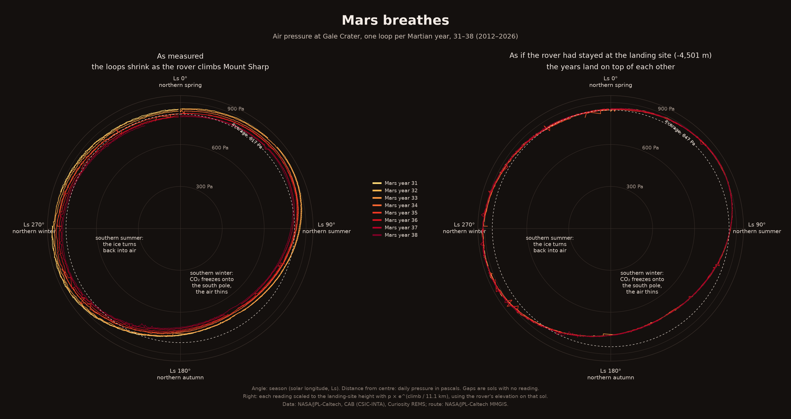

# Mars breathes



## The phenomenon

Every year a large share of the Martian atmosphere freezes out of the sky. Mars's air
is mostly carbon dioxide, and in the long, dark southern winter it gets cold enough at
the south pole for that CO₂ to fall as frost and snow. The air gets thinner across the
whole planet. When spring comes the ice sublimates back into gas and the air thickens
again. The north pole does the same thing half a year later, but less, because the
orbit is eccentric and the northern winter is shorter and warmer. So the pressure on
Mars goes up and down twice a year, unevenly, like a slow breath. I wanted to see it
measured from the ground, by one instrument, year after year.

## The source

The numbers come from Curiosity's weather station (REMS), published by NASA and the
Centro de Astrobiología as a JSON feed with no key:
<https://mars.nasa.gov/rss/api/?feed=weather&category=msl&feedtype=json>.
The file in `data/` holds 4,745 entries, one per sol (a Martian day, 24 h 40 min) from
sol 1 in August 2012 to sol 4995 in August 2026. Each entry has the sol, the Earth
date, the season as solar longitude (`ls`, in degrees), minimum and maximum air
temperature (°C) and the daily pressure (`pressure`, in pascals); 4,718 of them have a
pressure reading. Every value arrives as text, and `--` means no reading.

## What the picture shows

Each loop is one Martian year: the angle is the season, the distance from the centre
is the pressure that sol, and the dashed ring is the average, 817 Pa. Every loop bulges
past the ring in southern summer (Ls ≈ 250°, about 900 Pa) and sinks inside it in
southern winter (Ls ≈ 150°, about 700 Pa): a swing of roughly a quarter of the air
above Gale Crater, every year, for eight years.

What it hides: the time of day (REMS measures at different hours, and the feed gives
one number per sol), dust storms and the sols with no reading, which are just breaks
in the lines. It also hides the rover itself. The loops shrink year by year mostly
because Curiosity has been climbing Mount Sharp, and higher up the air is thinner, not
because Mars is losing its atmosphere.

## Run it

```
uv run fetch.py
uv run plot.py
```
