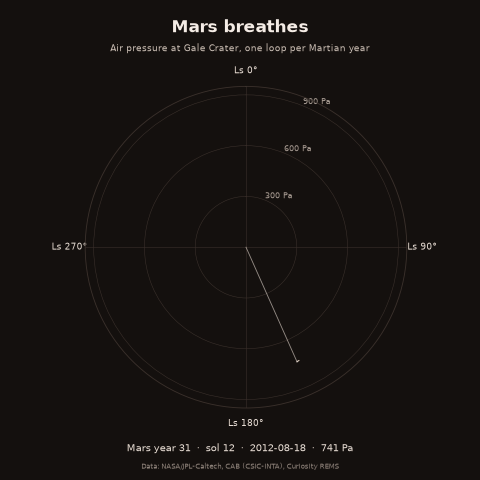
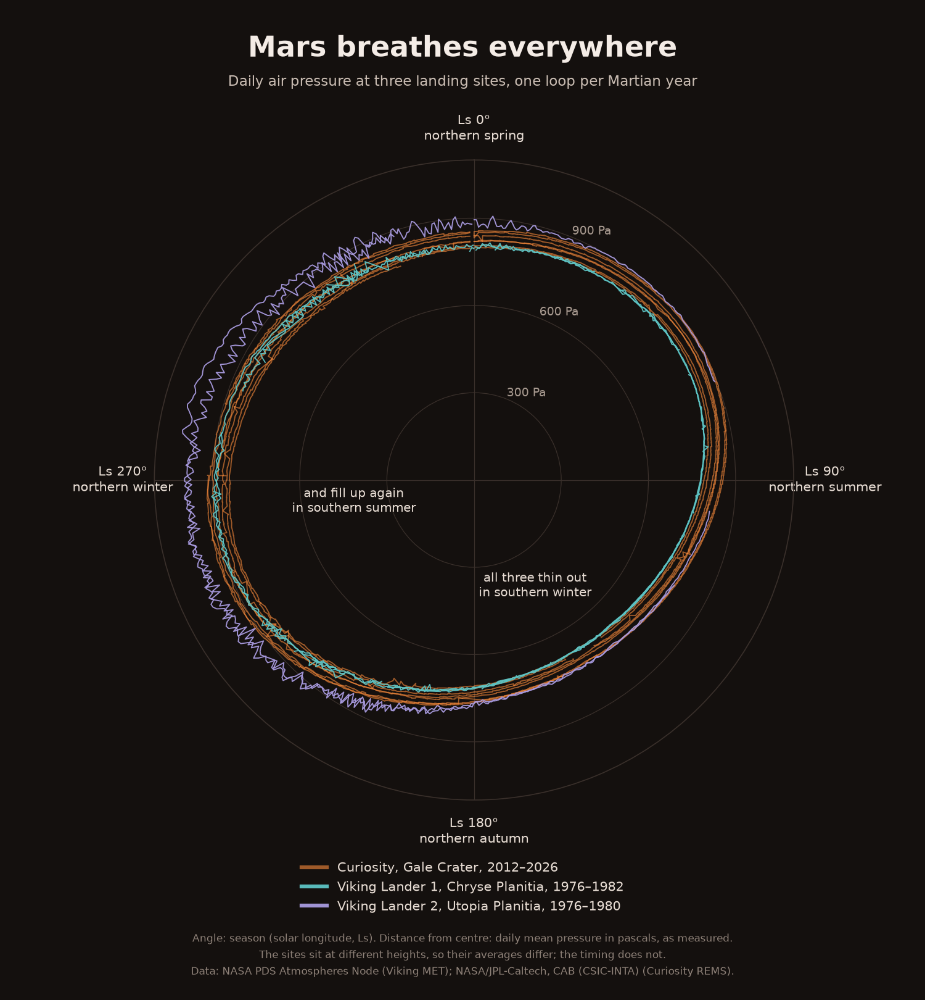

# Mars breathes


**Live page:** <https://CHEUNG1206.github.io/mars-breathes/>. Hover any sol, switch
years on and off, press Play. Then
[see where the rover was](https://CHEUNG1206.github.io/mars-breathes/map.html).

## The phenomenon

Every year a large share of the Martian atmosphere freezes out of the sky. Mars's air
is mostly carbon dioxide, and in the long, dark southern winter it gets cold enough at
the south pole for that CO₂ to fall as frost and snow. The air gets thinner across the
whole planet. When spring comes the ice sublimates back into gas and the air thickens
again. The north pole does the same thing half a year later, but less, because the
orbit is eccentric and the northern winter is shorter and warmer. So the pressure on
Mars goes up and down twice a year, unevenly, like a slow breath. I wanted to see it
measured from the ground, by one instrument, year after year.



## The source

The pressures come from Curiosity's weather station (REMS), published by NASA and the
Centro de Astrobiología as a JSON feed with no key:
<https://mars.nasa.gov/rss/api/?feed=weather&category=msl&feedtype=json>.
`data/curiosity-rems-weather.json` holds 4,745 entries, one per sol (a Martian day,
24 h 40 min), from sol 1 in August 2012 to sol 4995 in August 2026. Each entry has the
sol, the Earth date, the season as solar longitude (`ls`, in degrees), minimum and
maximum air temperature (°C) and the daily pressure (`pressure`, in pascals). 4,718
of them have a pressure reading. Every value arrives as text, and `--` means no reading.

The route comes from the map behind NASA's "Where is Curiosity?" page:
<https://mars.nasa.gov/mmgis-maps/MSL/Layers/json/MSL_waypoints.json>.
`data/curiosity-waypoints.json` is a GeoJSON file with 1,384 waypoints, one per drive,
each with its sol, longitude and latitude (degrees) and elevation (`elev_geoid`, in metres
relative to the Martian datum, so negative means below it). The map underneath is
[OpenPlanetaryMap](https://www.openplanetary.org/opm), an open-source basemap of Mars.
To level the pressures, `plot.py` uses a scale height of 11.0 km, from NASA's
[Mars fact sheet](https://nssdc.gsfc.nasa.gov/planetary/factsheet/marsfact.html).

The two Viking landers come from the NASA PDS Atmospheres Node:
<https://pds-atmospheres.nmsu.edu/PDS/data/vl_1001/data/vl_avep.dat>, with the label that
describes its columns (`vl_avep.lbl`) saved next to it.
`data/viking-daily-pressure.dat` is a fixed-width text table with 3,297 rows, one per
lander per sol: Viking Lander 1 for 2,246 sols (1976–1982) and Viking Lander 2 for
1,051 sols (1976–1980). Each row has the season (Ls, degrees) and the daily mean
pressure in millibars (1 mbar = 100 Pa). `-9.999` means no reading.

## What the picture shows

Each loop is one Martian year: the angle is the season, the distance from the centre
is the pressure that sol, and the dashed ring is the average, 817 Pa. Every loop bulges
past the ring in southern summer (Ls ≈ 250°, about 900 Pa) and sinks inside it in
southern winter (Ls ≈ 150°, about 700 Pa): a swing of roughly a quarter of the air
above Gale Crater, every year, for eight years.

What it hides: the time of day (REMS measures at different hours, and the feed gives
one number per sol), dust storms and the sols with no reading, which are just breaks
in the lines. It also hides the rover itself. The loops shrink year by year because
Curiosity has been climbing Mount Sharp, not because Mars is losing its atmosphere.
The map shows this. Between Mars years 32 and 37 the rover climbed 715 m, and its
yearly average pressure fell from 842 to 797 Pa. Height alone predicts 789 Pa.

The right half of the picture takes the climb out. Each reading is scaled back to
the landing site's height, using the rover's elevation on that sol. The eight
loops then lie on top of each other. At the same season, the years differed by a
median of 63 Pa as measured and by 6 Pa once levelled. The breath repeats; the
atmosphere is not leaking away.

One rover in one crater cannot speak for a whole planet, so the second picture adds
the two Viking landers. They stood thousands of kilometres from Gale Crater and
measured forty years earlier. All three sites thin out in southern winter and fill
up in southern summer, at the same seasons. A local weather effect would not do
that; a planet-wide one would. The sites sit at different heights, so their loops
differ in size.



What this hides: three points are still not a global average. Viking Lander 2, far
north in Utopia Planitia, swings higher and more raggedly in northern winter, from
local storms and cold air that the other two sites do not see. The levelling assumes
one scale height all year, although the real one changes with temperature.

## Who else measured the air, and is not here

Curiosity and the two Vikings are not the only barometers that have stood on Mars.
Mars Pathfinder measured pressure in Ares Vallis in 1997, for a few months. Phoenix
measured it near the north pole in 2008, for one northern summer. InSight measured
it in Elysium Planitia from 2018 to 2022. Perseverance's MEDA station has measured
it in Jezero Crater since 2021, and China's Zhurong rover measured it in Utopia
Planitia in 2021–22. Orbiters also estimate surface pressure from above, from how
the atmosphere bends radio signals and absorbs light, but those are not readings
taken on the ground.

This repo uses the Vikings and Curiosity because they are the longest records,
covering several Martian years each, and because each comes as one small file that
anyone can download without a key. The others are shorter, or are archived as
thousands of files per mission. Leaving them out is one more reason "three sites"
is not the same as "the whole planet".

## Run it

```
uv run fetch.py
uv run plot.py
uv run animate.py
uv run landers.py
uv run web.py
uv run map.py
```
